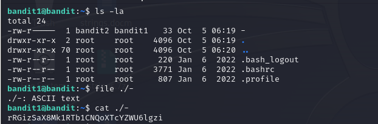

# Level 0 -> 1
Mục tiêu của level này là hướng dẫn chúng ta sử dụng SSH.

Ta kết nối đến bandit.labs.overthewire.org với port 2220.

Username: bandit0

**Using commandline: ssh bandit0@bandit.labs.overthewire.org -p 2220**

**Password:bandit0**

Mục tiêu của chúng ta là đi tìm Password để mở các level tiếp theo.

Ta sử dụng command ``ls`` kiểm tra xem có những thư mục nào.

Tại đây ta thấy 1 file readme.Dùng command ``cat`` Mở nó 
lên và ta thấy 1 đoạn mã.

Ta sẽ dùng đoạn mã này cho password ở level kế tiếp.



```
Password: NH2SXQwcBdpmTEzi3bvBHMM9H66vVXjL
```
