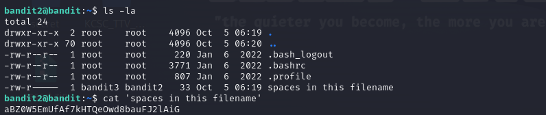

# Level 1 -> 2
Xem qua hướng dẫn thì thấy cần mở file ``-`` để xem password trong đó.

Bước 1:
Thiết lập kết nối

```ssh bandit0@bandit.labs.overthewire.org -p 2220```

Password:``NH2SXQwcBdpmTEzi3bvBHMM9H66vVXjL``

Sử dụng ``ls -la`` để kiểm tra xem có thư mục, tệp tin nào trong đường dẫn hiện tại.

Sử dụng câu lệnh: ``cat .\-`` đế mở file ``-``.


Từ đây ta tìm được Password:
```rRGizSaX8Mk1RTb1CNQoXTcYZWU6lgzi```
