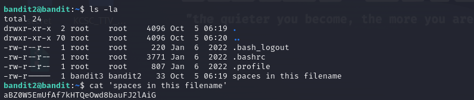

# Level 2 -> 3
Mục tiêu bài này là giúp ta biết cách mở file mà trong tên của nó có khoảng cách trắng.

Để mở tên file có tên chứa khoảng cách trắng, ta chỉ cần thêm cặp ``''``vào tên file mở chúng.

Bước 1: Kết nối ssh với command line:

```bandit2@bandit.labs.overthewire.org```

Password: ```rRGizSaX8Mk1RTb1CNQoXTcYZWU6lgzi```

Sau khi kết nối thành công, ta bắt đầu đi tìm password.

``ls -la`` để kiểm tra các tệp thư mục, file.

Ta thấy có file ``spaces in this file name``, và sẽ mở nó bằng câu lệnh:

```cat 'spaces in this file name'```

Ta thu được kết quả:



Password cần tìm:

```aBZ0W5EmUfAf7kHTQeOwd8bauFJ2lAiG```


