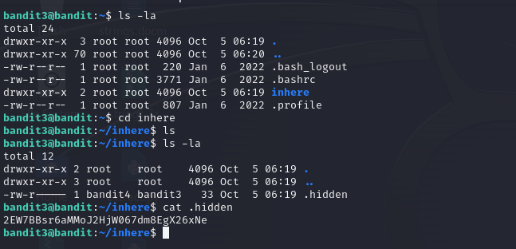

# Level 3 -> 4
Mục tiêu bài này là giúp chúng ta biết sử dụng câu lệnh để hiện thị file, folder bị ẩn. Và để thực hiện thì ta sử dụng: ``ls -la``

Password của bài này là ở trong file ẩn nào đó.  Và ta sẽ phải tìm ra nó.

Bước 1: Kết nối ssh với command line:

```bandit2@bandit.labs.overthewire.org```

Password:``aBZ0W5EmUfAf7kHTQeOwd8bauFJ2lAiG``

Sau khi kết nối ssh thành công, tại cửa sổ dòng lệnh, sử dụng ``ls -la`` để kiểm tra có file, folder nào khả nghi không.

Ta thấy có thư mục ``inhere`` và ta đi vào đó để tìm Password.

Ta thực hiện như trong hình và tìm được Password.



Tìm thấy pass rồi nè.

```Password: 2EW7BBsr6aMMoJ2HjW067dm8EgX26xNe```