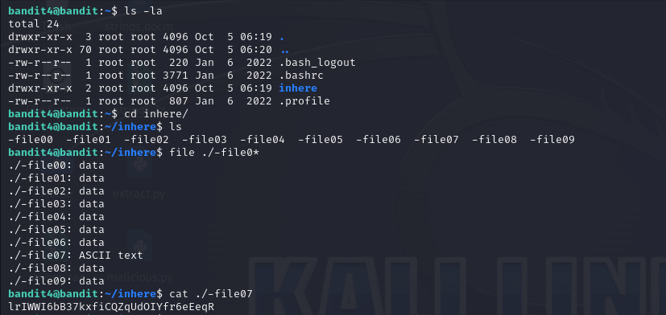

# Level 4 -> 5
Mục tiêu: Tìm password trong file mà có chứa kí tự con người có thể đọc được trong thư mục ``inhere``

Bước 1: Kết nối ssh với command line:

```bandit4@bandit.labs.overthewire.org```

Password: ```2EW7BBsr6aMMoJ2HjW067dm8EgX26xNe```

Sau khi kết nối thành công, kiểm tra qua các thư mục thì ta thấy trong file ``inhere`` có khá nhiều file. Thử mở 1 file đầu thì file sẽ trả lại những dữ liệu ta không đọc được.

Sử dụng lệnh ``file [tên file]`` để kiểm tra thì thấy đấy là file data.

Mục tiêu là chúng ta sẽ kiểm tra tất cả các file xem file nào chứa ký tự đọc được và lấy password.

Để kiểm tra các file nhanh chóng ta sử dụng lệnh ``file ./-file0*`` và ta có kết quả có 1 file là có kiểu ``ASCII text``. Mở thử lên xem có pass không và nó ở đây.


Password cần tìm: ```lrIWWI6bB37kxfiCQZqUdOIYfr6eEeqR```
