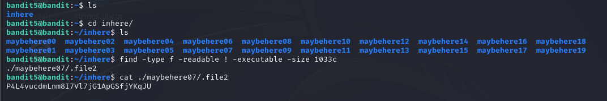

# Level 5 -> 6
Mục tiêu bài này giúp ta biết sử dụng các commands để lọc các file, folder theo yêu cầu, mục đích.

Theo gợi ý của thử thách:

* **human-readable**
* **1033 bytes in size**
* **not executable**

Thiết lập kết nối

```ssh bandit5@bandit.labs.overthewire.org -p 2220```

Password: ``lrIWWI6bB37kxfiCQZqUdOIYfr6eEeqR``

Sau khi kết nối thành công. Ta thực hiện kiểm tra thư mục file ở đường dẫn hiện tại. Ta thấy có thư mục ``inhere``, xem thư mục này có gì? thì ta thấy có rất nhiều thư mục con.

Tại đây nếu mà để kiểm tra từng thư mục để kiếm password thì mò đến mùa bay về tế đàn :)

Nhớ lại có gợi ý và sử dụng nó để có command line:

``file -type f -readable ! -executable -size 1033c``

Và ta thấy 1 file đúng yêu cầu. Mở nó lấy pass để đến với thử thách tiếp theo nào.



Password nè: ```P4L4vucdmLnm8I7Vl7jG1ApGSfjYKqJU```
