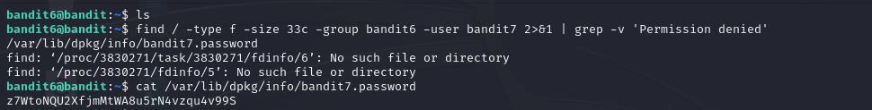

# Level 6 -> 7
Mục tiêu tìm password được lưu trữ **đâu đó trên server** với yêu cầu sau:

* **owned by user bandit7**
* **owned by group bandit6**
* **33 bytes in size**

Bước 1: Kết nối tới Server.

Thiết lập kết nối

```ssh bandit6@bandit.labs.overthewire.org -p 2220```

Password: ```P4L4vucdmLnm8I7Vl7jG1ApGSfjYKqJU```

Theo gợi ý, password bài này có thể nằm trong thư mục hiện tại hoặc cũng có thể không. Nên bài này ta sẽ tìm kiếm file theo yêu cầu và quét qua từng đường dẫn, thư mục( kể từ thư mục gốc ``/``)

Sử dụng command ``find`` để tìm kiếm:

```find / -type f -size 33c -group bandit6 -user bandit7 2>&1 | grep -v 'Permission denied'```

Ta thu được file cần tìm và mở nó lên, lấy pass nào.


Password nè: ``z7WtoNQU2XfjmMtWA8u5rN4vzqu4v99S``