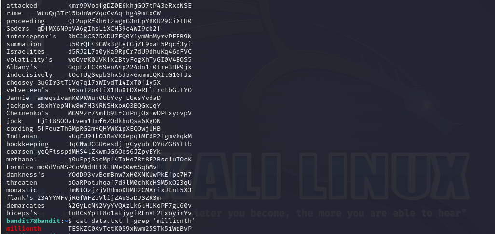

# Level 7 -> 8
Mục tiêu sử dụng ``grep`` để tìm password chứa từ khóa ``millionth`` trong file ``data.txt``.
Bước 1: Kết nối đến Server.
Thiết lập kết nối

```ssh bandit7@bandit.labs.overthewire.org -p 2220```

Password: ```z7WtoNQU2XfjmMtWA8u5rN4vzqu4v99S```

Tiếp theo ta thử kiểm tra các file, thư mục có nghi ngờ chứa pass. Ta thấy file ``data.txt``, mở lên thì thấy rất nhiều password.


Dựa vào gợi ý, ta sẽ tìm password với từ khóa ``millionth``.

Thực hiện command line: ``cat data.txt | grep 'millionth'``

Và ta cũng thu được pass mong muốn.



Password cần tìm nè: ```TESKZC0XvTetK0S9xNwm25STk5iWrBvP```
