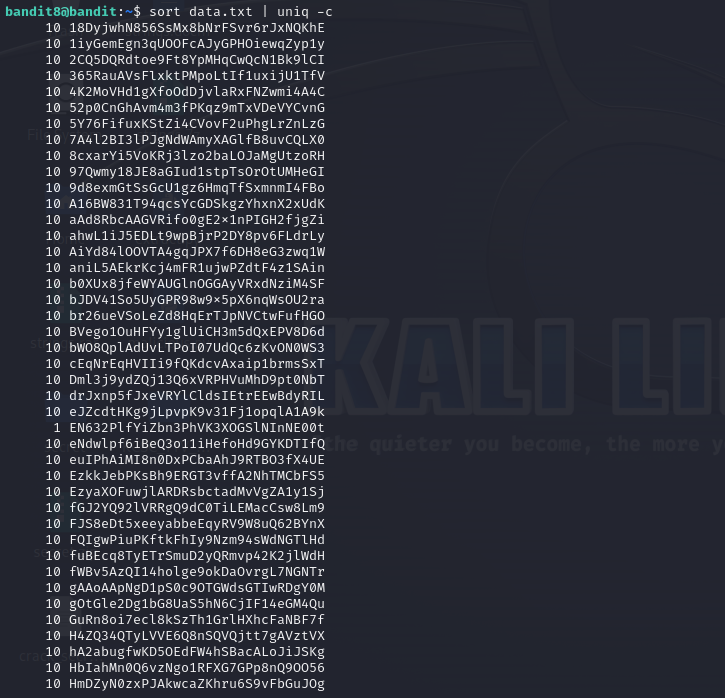

# Level 8 -> 9
Mục tiêu bài này tìm password xuất hiện 1 lần trong file nào đấy. Bài này giúp chúng ta thành thạo sử dụng linux hơn.

Bước 1: Kết nối đến Server.
Thiết lập kết nối

```ssh bandit8@bandit.labs.overthewire.org -p 2220```

Password: ``TESKZC0XvTetK0S9xNwm25STk5iWrBvP``

Sau khi kết nối thành công, ta kiểm tra file nghi ngờ nào đó chứa password. Ta thấy file ``data.txt``, mở nó lên và thấy rất nhiều pass khác nhau.


Theo gợi ý từ đề bài thì ta phải tìm kiếm dòng văn bản nào chỉ xuất hiện 1 lần và ta sử dụng command line sau để thực hiện tìm kiếm:

``sort data.txt | uniq -c``

Và ta thu được kết quả như sau:



Các bạn có thấy dòng có mỗi số 1 không nhỉ. Password chúng ta cần tìm đó.

```EN632PlfYiZbn3PhVK3XOGSlNInNE00t```
